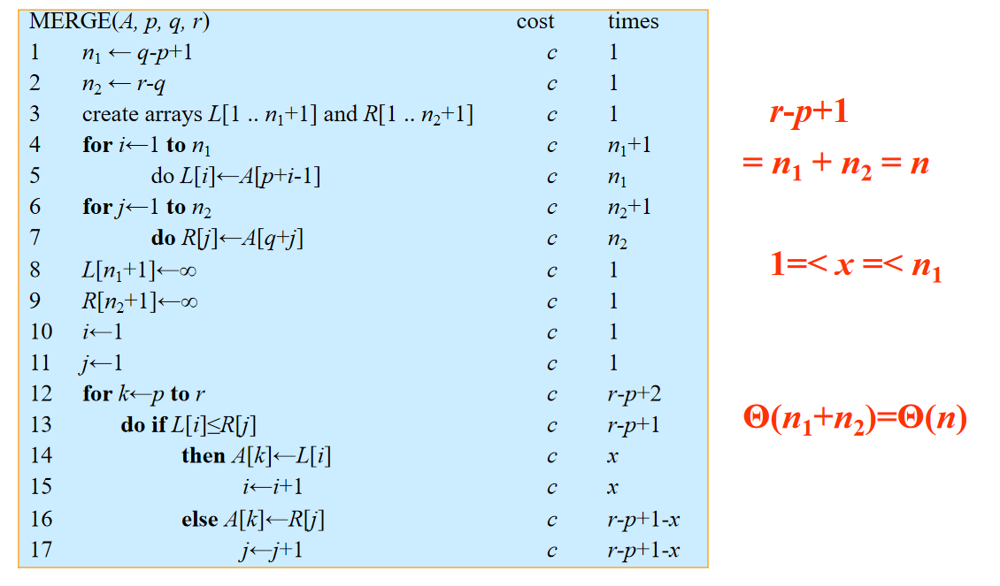
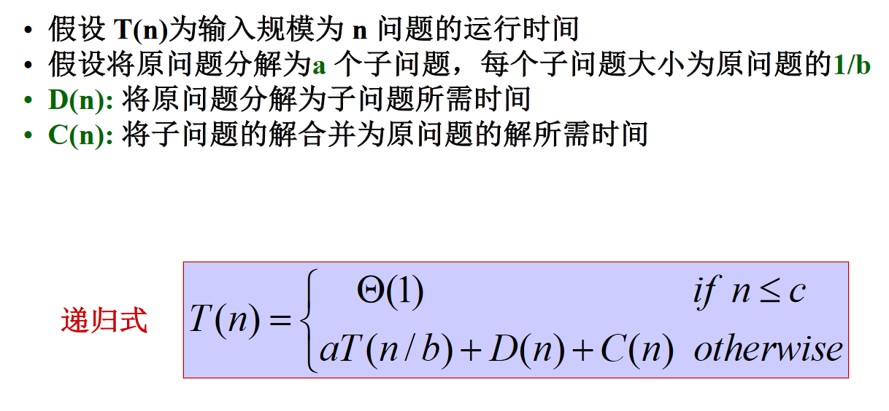
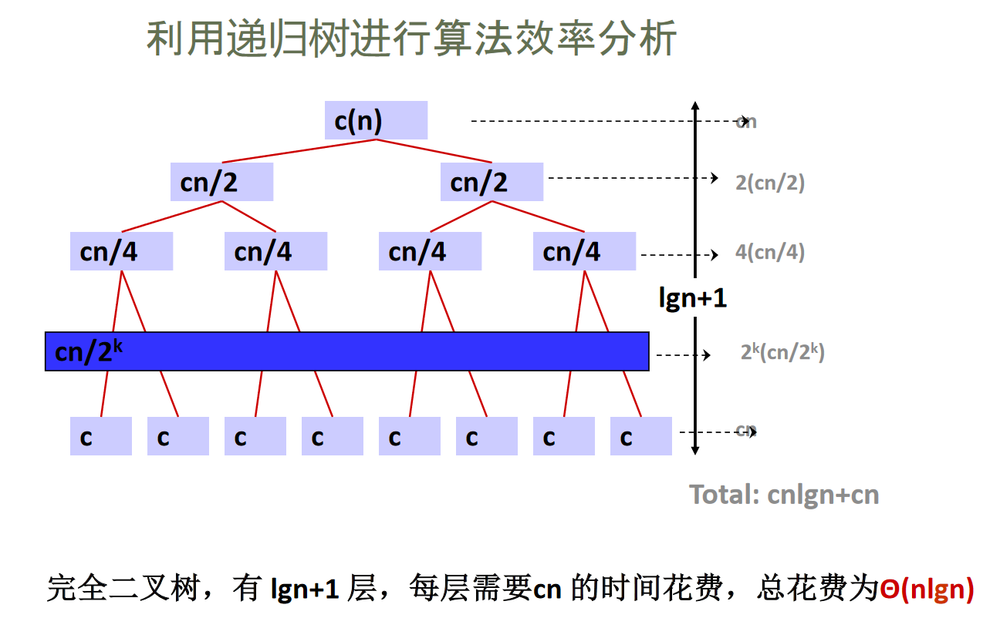
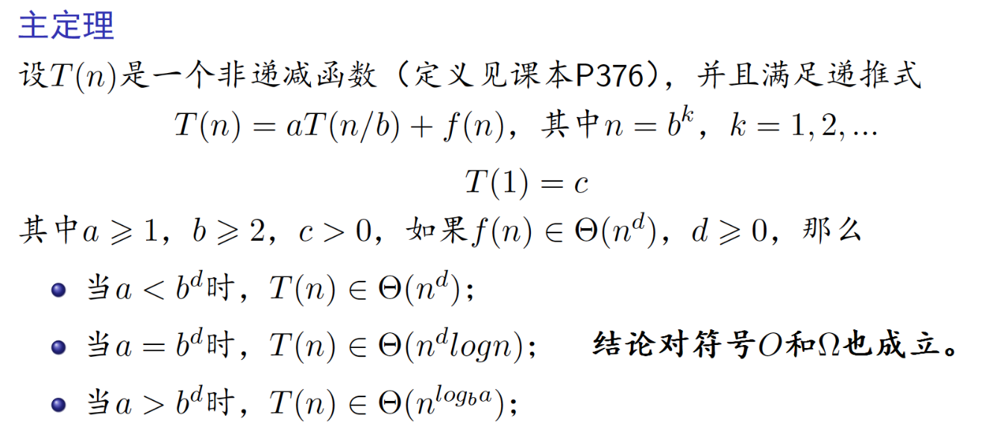

# 分治与递归策略

## 基本思想

分治法基本策略（分而治之，各个击破）：
（分）将一个问题划分为同一类型的若干子问题，子问题最好规模相同。
（治）对这些子问题求解（通常使用递归的方式）。
（合并）如果有必要，合并这些子问题的解，以得到原问题的解。

## 例子：合并排序

分解：将原来n个元素的序列分成两个包含n/2元素的待排序的子序列
解决:对两个子序列递归地进行合并排序
合并:把两个已排序的子序列进行合并，得到排序结果

当递归过程到到最底端，此时要排序的序列只包含一个元素，不需要再进行分解，一个元素是已排好序的

## 合并排序算法时间复杂度分析

## 分治法时间复杂度分析

## 递归算法时间复杂度分析

## 例子：快速排序

## 贪心算法

求问题的整体最优解可以通过一系列局部最优的选择，即贪心选择来达到,即一个最优解以贪心选择开始。

贪心算法则通常以自顶向下的方式进行，以迭代的方式作出相继的贪心选择，每作一次贪心选择就将所求问题简化为规模更小的子问题。

### 最优子结构性质

当一个问题的最优解包含其子问题的最优解时，称此问题具有最优子结构性质。

问题的最优子结构性质是该问题可用动态规划算法或贪心算法求解的关键特征。	

