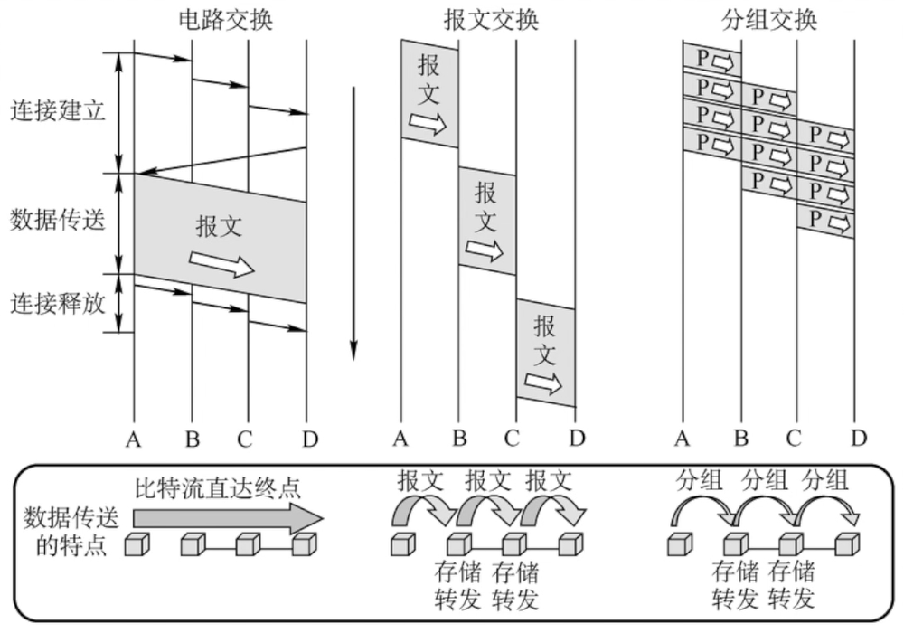

# 网络层

## 网络层功能概述

主要任务是把分组从源端传到目的端，为分组交换网上的不同主机提供通信服务。网络层传输单位是数据报。

功能一：路由选择与分组转发（选择最佳路径）

功能二：异构网络互联

功能三：拥塞控制

## 数据交换方式

### 电路交换

e.g. 电话网络：建立连接/电路建立（拨号与应答） -> 数据通信（交流） -> 释放连接（挂断电话）

优点：1. 通信时延小；2. 有序传输；3. 没有冲突；4. 实时性强；

缺点：1. 建立连接时间长；2. 线路独占，使用效率低；3. 灵活性差；4. 无差错控制能力；

### 报文交换

报文：源应用发送的信息整体；将整个报文通过交换设备**存储转发**到目的主机

优点：1. 无需建立连接；2. 存储转发，动态分配线路；3. 线路可靠性较高；4. 线路利用率较高；5. 多目标服务；

缺点：1. 有存储转发时延；2. 报文大小不定，需要网络节点有较大缓存空间；

### 分组交换

分组：把大的数据块分割成小的数据块。也采用**存储转发**的方式

优点：1. 无需建立连接；2. 存储转发，动态分配线路；3. 线路可靠性较高；4. 线路利用率较高；5. 相对于报文交换，存储管理更容易；

缺点：1. 有存储转发时延；2. 需要传输额外的信息量；3. 乱序到目的主机时，要对分组排序重组；

> 对于传输时延计算题需要注意的知识点：
>
> 1. 单位换算：1Byte = 8bit；Mbps代表每秒传输 $10^6$位bit，即125000Bytes/s，Kbps代表每秒传输$10^3$位bit，即125Bytes/s
> 2. 是否考虑传播延迟
> 3. 时间至少是多少——选择最少跳数
> 4. 起始时间（从发送开始到接收完/从发送开始到发送完）
> 5. 是否有分组头部大小的开销
> 6. 报文交换时延更长，分组交换时延可能不是整数

### 交换方式总结

1. 报文交换和分组交换都用了存储转发方式。
2. 传送数据量大，且传送时间远大于呼叫时间，可以选择电路交换；电路交换传输时延最小。
3. 从信道利用率看，报文交换和分组交换优于电路交换，其中分组交换时延更小。

### 数据报方式&虚电路方式

**数据报方式**为网络层提供无连接服务，不事先为分组的传输确定路径，每个分组独立确定传输路径，不同分组传输路径可能不同；

**虚电路方式**为网络层提供连接服务，首先为分组的传输确定传输路径（建立连接），然后沿该路径（连接）传输系列分组，系列分组传输路径相同，传输结束后拆除连接。

