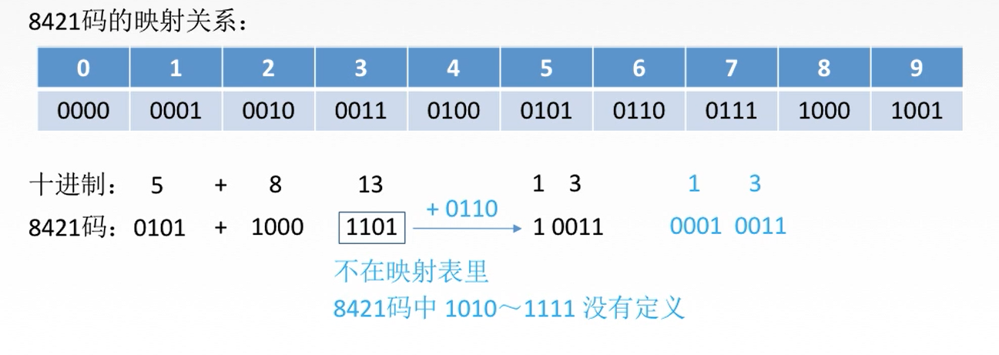
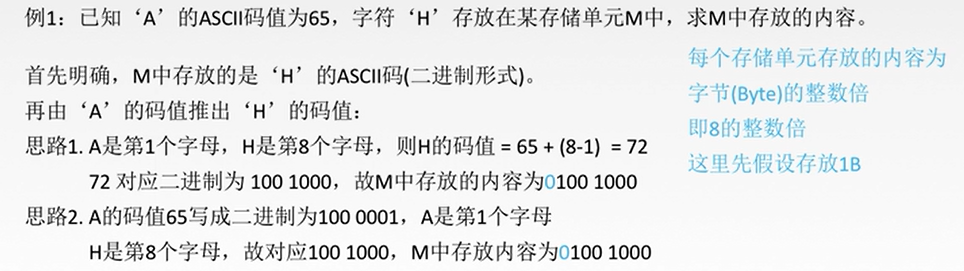

## 进位计数法

基数：每个数位所用到的不同符号的个数。

## 进制转换

### 任意进制与十进制

任意进制转十进制：
$$
十进制：75 = 70 + 5 = 7×10+5×1=7×10^1+5×10^0
$$

$$
r进制：K_nK_{n-1}...K_1K_0=K_n×r^n+K_{n-1}×r^{n-1}+...+K_×r^1+K_0×r^0
$$

十进制转任意进制：

整数部分使用除基取余法：

小数部分使用乘积取整法：

### 2^n进制之间的转换

### 真值和机器数

在二进制数前加0或1来表示正或负。

### BCD码

BCD：Binary-Coded Decimal；使用二进制编码十进制处理，用8421码映射关系一一对应。

在计算时直接加减，若结果不在8421表内，则+6(+0110)，四位一空，得到可用8421表示的数字。

### 字符

ASCII码：将数字、字母、符号总结为共128个字符，即2^7个，就可用7位二进制编码表示所有ASCII码；大小写字母在ASCII码中是分别连续存放的。

### 奇偶校验

奇校验：保证一段数据中出现奇数个1；仅需增加一位校验位，一般位于有效信息位之前。

偶校验：整个校验码中1的个数为偶数。

奇偶校验码之能检验出奇数位错误，且无法增加校验码数量。

### 海明码

