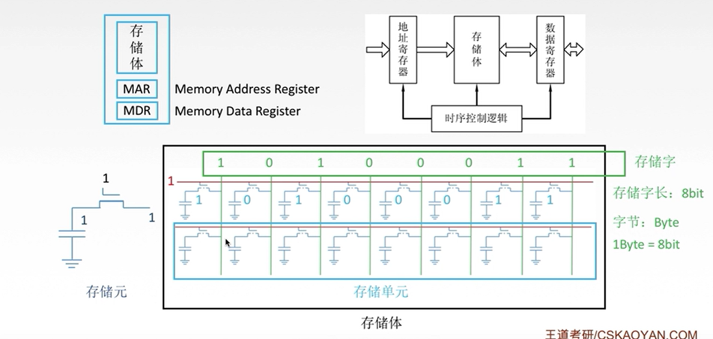
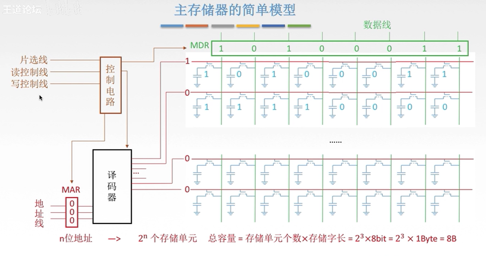

# 存储器

## 主存储器

### 简介

主存储器包括三个部件：存储体、MAR(Memory Address Register)、MDR(Memory Data Register)；其中，**存储体**用来存储具体的二进制位，**地址寄存器**用来接收外部功能部件传来的地址，**数据寄存器**用来暂存要存入或传出的数据信号；三者在一个**时序逻辑控制**单元下进行协同工作。

### 简单模型

