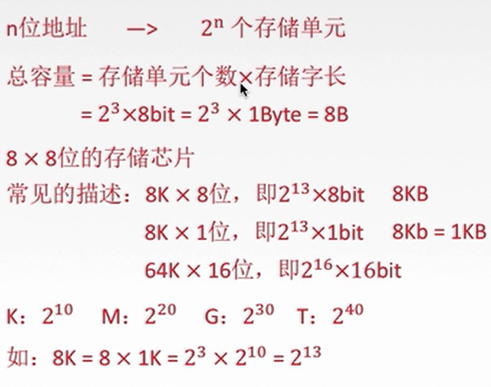
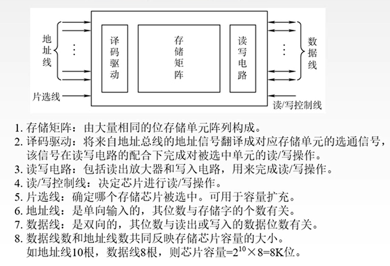
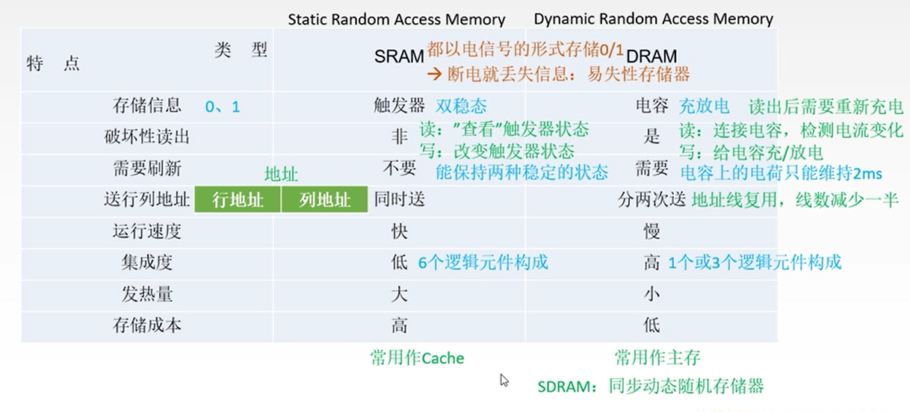
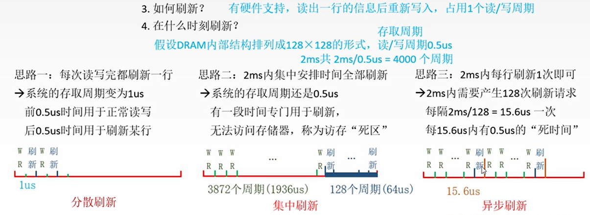
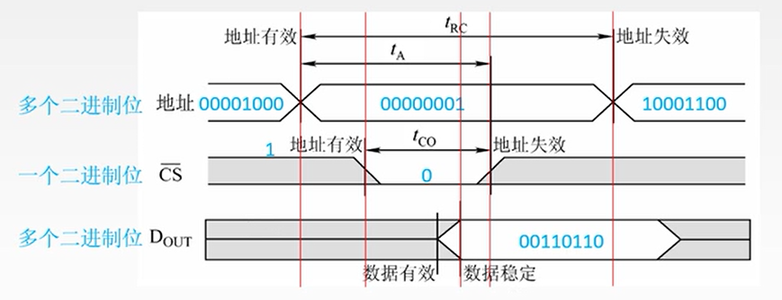
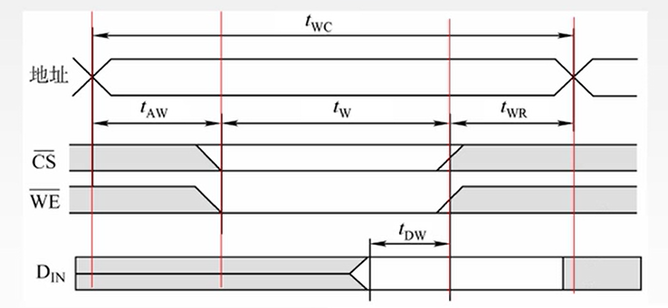
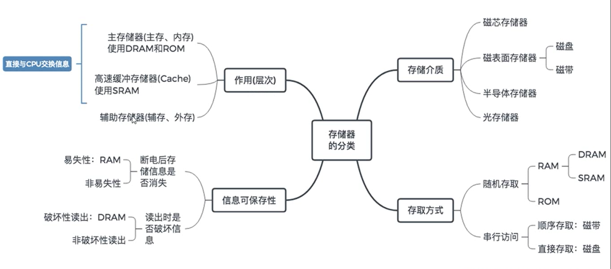
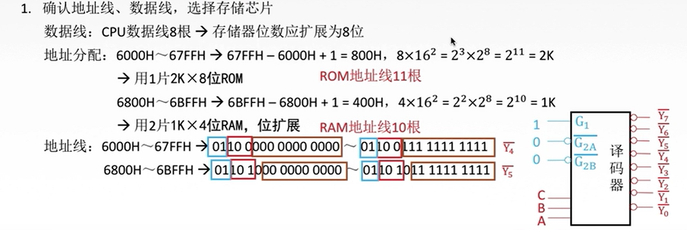
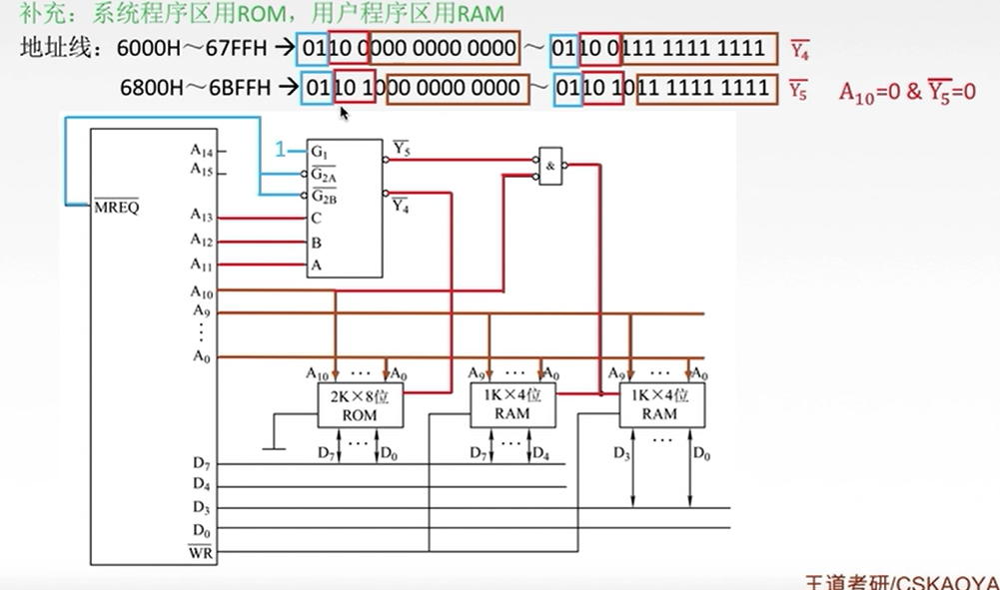

# 存储器

## 主存储器

### 简介

主存储器包括三个部件：存储体、MAR(Memory Address Register)、MDR(Memory Data Register)；其中，**存储体**用来存储具体的二进制位，**地址寄存器**用来接收外部功能部件传来的地址，**数据寄存器**用来暂存要存入或传出的数据信号；三者在一个**时序逻辑控制**单元下进行协同工作。

### 简单模型

地址线线数对应MAR的位数，数据线的根数对应MDR的长度；即地址线对应行数，数据线对应列数（存储字长）。

由此可计算：总容量 = 存储单元个数 × 存储字长 = 2^(地址线数) × 8bit

例：8K = 8 × 1K = 2^3 × 2^10 = 2^13；由此，8K×8位 芯片即2^13 × 8bit = 8KB

### 寻址

由寻址方法与总容量，可以推算出地址线根数；在寻址方式下对存储器的分组中，有大端方式与小段方式两种存放方法。

## 半导体存储器RAM

### 主存的整体结构

### SRAM与DRAM

### DRAM的刷新

### 工作周期

读周期

写周期

### 只读存储器Read-Only Memory

由于RAM是易失的，在主机开机时，需要通过一些存储器掉电后不丢失且可以和CPU沟通，用以存储一些关键信息，如OS在辅存中的地址等。

### 存储器的分类

### 主存与CPU的连接

### Cache

