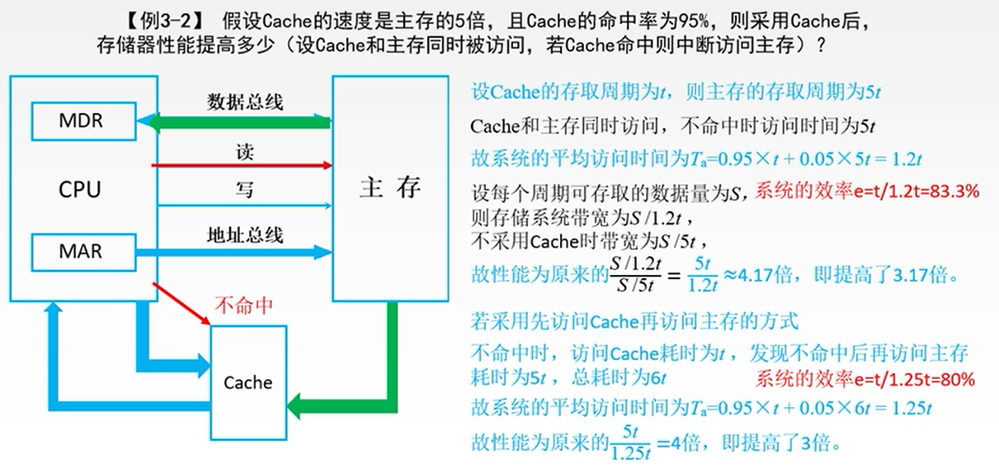
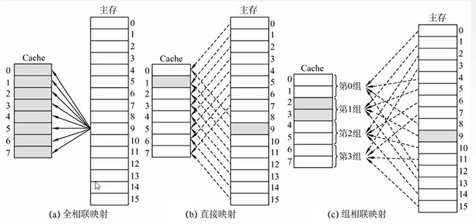
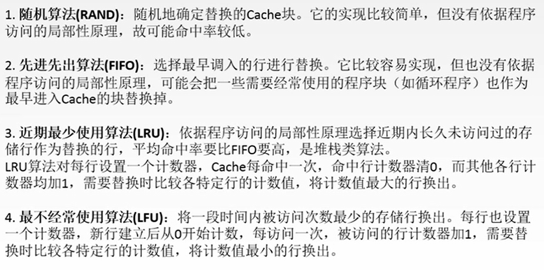
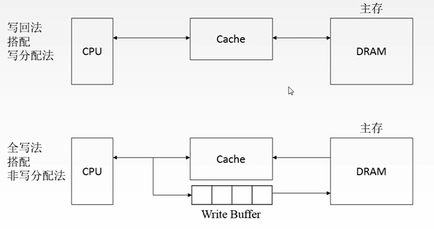
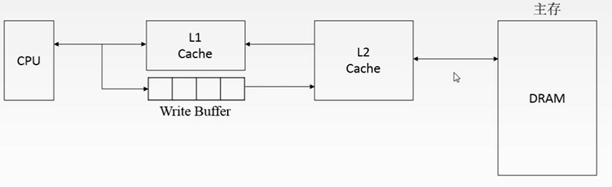

# 存储器

## 主存储器

### 简介

主存储器包括三个部件：存储体、MAR(Memory Address Register)、MDR(Memory Data Register)；其中，**存储体**用来存储具体的二进制位，**地址寄存器**用来接收外部功能部件传来的地址，**数据寄存器**用来暂存要存入或传出的数据信号；三者在一个**时序逻辑控制**单元下进行协同工作。

### 简单模型

地址线线数对应MAR的位数，数据线的根数对应MDR的长度；即地址线对应行数，数据线对应列数（存储字长）。

由此可计算：总容量 = 存储单元个数 × 存储字长 = 2^(地址线数) × 8bit

例：8K = 8 × 1K = 2^3 × 2^10 = 2^13；由此，8K×8位 芯片即2^13 × 8bit = 8KB

### 寻址

由寻址方法与总容量，可以推算出地址线根数；在寻址方式下对存储器的分组中，有大端方式与小段方式两种存放方法。

## 半导体存储器RAM

### 主存的整体结构

### SRAM与DRAM

### DRAM的刷新

### 工作周期

读周期

写周期

## 只读存储器Read-Only Memory

由于RAM是易失的，在主机开机时，需要通过一些存储器掉电后不丢失且可以和CPU沟通，用以存储一些关键信息，如OS在辅存中的地址等。

## 存储器的分类

## 主存与CPU的连接

## Cache

### 局部性原理

空间局部性：在最近的未来要用到的信息（指令和数据），很可能与现在正在使用的信息在存储空间上是临近的。

时间局部性：在最近的未来要用到的信息，很可能是现在正在使用到的信息。

### 性能分析

**命中率H**：CPU欲访问的信息已在cache中的比率；设一个程序执行期间，Cache的总命中次数为Nc，访问主存的总次数为Nm，则H = Nc / (Nc + Nm)；缺失率M = 1 - H；

设tc为命中时的cache访问时间，tm为未命中时的访问时间；Cache—主存系统的平均访问时间Ta = Htc + (1 - H)tm

### Cache地址映射

1. 全相联映射：空位随意放；

   【主存字块标记】【字块内地址】

2. 直接映射：对号入座

   【主存字块标记】【Cache字块地址】【字块内地址】

3. 组相联映射：按号分组，组内随意放

   【主存字块标记】【组地址】【字块内地址】

cache中存储的内容：标记项+数据；

### cache替换算法及写策略

多级cache：

