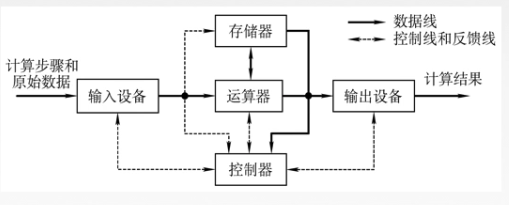
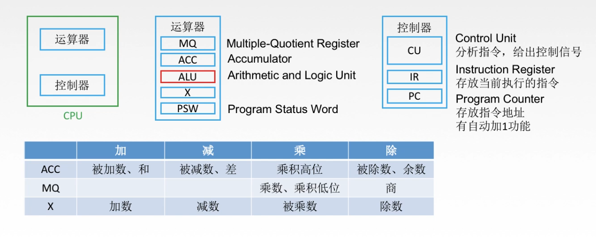

## 计算机硬件的发展

### 电子管时代

第一台**电子数字**计算机：ENIAC；使用机器语言；占地约170平方米；耗电量150KW；包含了17468根真空管；

**内存：汞延迟线、磁鼓；外存：穿孔卡片、纸带；**

### 晶体管时代

第一台使用晶体管线路的计算机：TRADIC；面向过程的程序设计语言：FORTRAN；有了操作系统的雏形；耗电量30W

**内存：磁芯存储器；外存：磁带；**

### 中小规模集成电路

高级语言迅速发展，有了分时操作系统

**内存：半导体存储器；外存：磁带、磁盘**

### 大规模、超大规模集成电路

产生了微处理器；新的概念：并行、流水线、高速缓存、虚拟存储器……

**内存：半导体存储器；外存：磁盘、磁带、光盘、半导体存储器**

## 微处理器的发展

微型计算机的发展以微处理器技术为标志。

机器字长：计算机一次整数运算所能处理的二进制位数。

操作系统位数：其所依赖的指令集的位数。

## 计算机软件的发展

### 语言发展

机器语言、汇编语言；

针对设计目标（科学与工程计算）：FORTRAN

模块化语言：PASCAL

面向对象语言：C++

网络化语言：JAVA

### 操作系统发展

DOS

批量处理需求：Unix

界面友好：Windows

……

## 计算机的分类与发展方向

### 指令和数据流：

1. 单指令流&单数据流（SISD）：冯诺依曼体系结构
2. 单指令流&多数据流（SIMD）：阵列处理器、向量处理器
3. 多指令流&多数据流（MIMD）：多处理器、多计算机

## 计算机的组成

软件和硬件在**逻辑**上是等效的。

###  冯诺依曼计算机的特点

1. 计算机由五大部件组成。
2. 指令和数据以同等地位存于存储器，可按地址寻访。
3. 指令和数据用二进制数表示。
4. 指令由操作码和地址码组成。
5. **存储程序**。（程序存放在存储器当中）
6. **以运算器为中心。**

### 运算器与控制器

这两块芯片在结构上十分类似，且联系十分紧密，故一般将二者制作在同一块芯片上，称为CPU。CPU与主存储器并称为主机。

**运算器**：MQ（乘商寄存器）、ACC（累加器）、**ALU**（算术逻辑单元）、X（通用寄存器）、PSW（程序状态字寄存器）

**控制器**：CU（控制单元，分析指令，给出控制信号）、IR（指令寄存器，存放当前执行的指令）、PC（存放指令地址，有自动+1功能）

### 存储器

主存储器：MAR、MDR、存储体

存储体：存储单元->存储元件->存储字

存储单元存放一串二进制代码；存储字是存储单元中二进制代码的组合；存储字长为存储单元中二进制代码的位数。

MAR：存储器地址寄存器，反应了存储单元的个数。

MDR：存储器数据寄存器，反映了存储字长。
