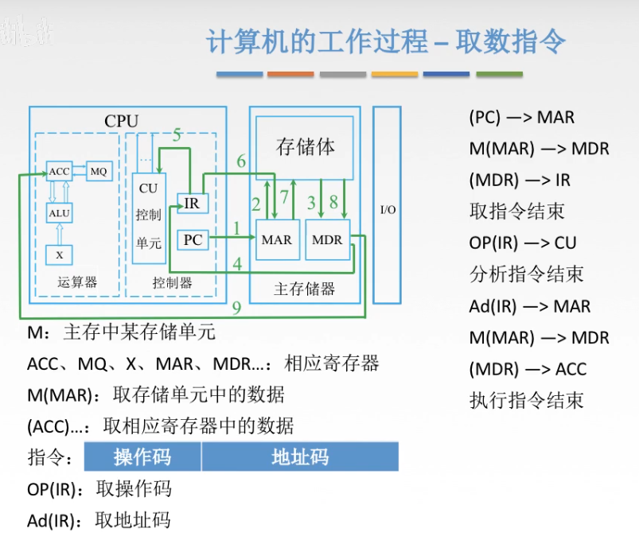
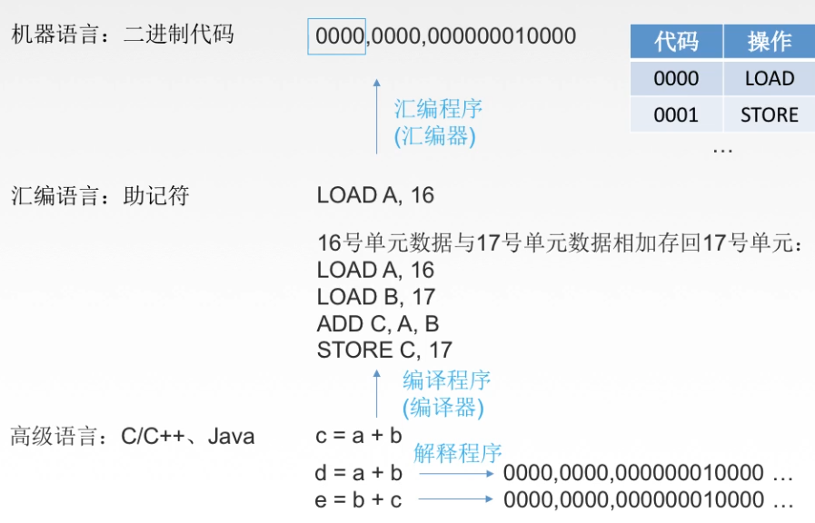

## 计算机硬件的发展

### 电子管时代

第一台**电子数字**计算机：ENIAC；使用机器语言；占地约170平方米；耗电量150KW；包含了17468根真空管；

**内存：汞延迟线、磁鼓；外存：穿孔卡片、纸带；**

### 晶体管时代

第一台使用晶体管线路的计算机：TRADIC；面向过程的程序设计语言：FORTRAN；有了操作系统的雏形；耗电量30W

**内存：磁芯存储器；外存：磁带；**

### 中小规模集成电路

高级语言迅速发展，有了分时操作系统

**内存：半导体存储器；外存：磁带、磁盘**

### 大规模、超大规模集成电路

产生了微处理器；新的概念：并行、流水线、高速缓存、虚拟存储器……

**内存：半导体存储器；外存：磁盘、磁带、光盘、半导体存储器**

## 微处理器的发展

微型计算机的发展以微处理器技术为标志。

机器字长：计算机一次整数运算所能处理的二进制位数。

操作系统位数：其所依赖的指令集的位数。

## 计算机软件的发展

### 语言发展

机器语言、汇编语言；

针对设计目标（科学与工程计算）：FORTRAN

模块化语言：PASCAL

面向对象语言：C++

网络化语言：JAVA

### 操作系统发展

DOS

批量处理需求：Unix

界面友好：Windows

……

## 计算机的分类与发展方向

### 指令和数据流：

1. 单指令流&单数据流（SISD）：冯诺依曼体系结构
2. 单指令流&多数据流（SIMD）：阵列处理器、向量处理器
3. 多指令流&多数据流（MIMD）：多处理器、多计算机

## 计算机的组成

软件和硬件在**逻辑**上是等效的。

###  冯诺依曼计算机的特点

1. 计算机由五大部件组成。
2. 指令和数据以同等地位存于存储器，可按地址寻访。
3. 指令和数据用二进制数表示。
4. 指令由操作码和地址码组成。
5. **存储程序**。（程序存放在存储器当中）
6. 以**运算器**为中心。

### 运算器与控制器

这两块芯片在结构上十分类似，且联系十分紧密，故一般将二者制作在同一块芯片上，称为CPU。CPU与主存储器并称为主机。

**运算器**：MQ（乘商寄存器）、ACC（累加器）、**ALU**（算术逻辑单元）、X（通用寄存器）、PSW（程序状态字寄存器）

**控制器**：CU（控制单元，分析指令，给出控制信号）、IR（指令寄存器，存放当前执行的指令）、PC（存放指令地址，有自动+1功能）

**机器字长**：计算机进行一次整数运算所能处理的二进制数据的位数。

**CPU时钟周期**：时钟周期是由CPU时钟定义的定长时间间隔，是CPU工作的最小时间单位。

CPU时钟频率（**主频**）=1/CPU时钟周期

**CPI**(Clock cycle Per Instruction)：执行一条指令所需的时钟周期数

某指令耗时：CPI × CPU时钟周期

**MIPS**(Million Instructions Per Second)：每秒执行多少百万条指令。

MIPS = 指令条数/(执行时间×10^6) = 主频/CPI

同理可得：MFLOPS(Mega Floating-point Operations Per Second)，

GFLOPS(Giga Floating-point Operations Per Second)，

TFLOPS(Tera Floating-point Operations Per Second)；

**数据通路带宽**：数据总线一次所能并行传送信息的位数；

**吞吐量**：指系统在单位时间内处理请求的数量；（主要取决于主存的存取周期）

**响应时间**：指从用户向计算机发送一个请求，到系统对该请求做出响应并获得它所需要的结果的等待时间，通常包括CPU时间（运行一个程序所花费的时间）与等待时间（用于磁盘访问、存储器访问、I/O操作、操作系统开销等时间）

### 存储器

存储器分为主存储器和辅助存储器，主存储器与CPU（运算器、控制器）共同称为主机，辅助存储器与I/O设备共同称为外设。

主存储器：MAR、MDR、存储体

*地址寄存器与存储体之间还有【译码器与驱动器】

存储体：存储体->存储单元->存储元件(存储字)

存储单元存放一串二进制代码；存储字是存储单元中二进制代码的组合；存储字长为存储单元中二进制代码的位数。

若一个存储单元可以存放8个二进制数，则该机器存储字长为8bit。

字节：Byte(B); 1Byte = 8bit

MAR(Memory Address Register)：存储器**地址**寄存器，反应了存储单元的个数。（因为每n位地址对应$2^n$个存储单元）

MDR(Memory Data Register)：存储器**数据**寄存器，反映了存储字长。（因为从存储体中取出的数据是送往MDR的）
$$
n位地址 -> 2^n个存储单元；
$$

$$
总容量=存储单元个数×存储字长(bit)=存储单元个数×存储字长/8(Byte)
$$

## 计算机编程语言

**汇编、编译、解释**

## 计算机系统层次结构

