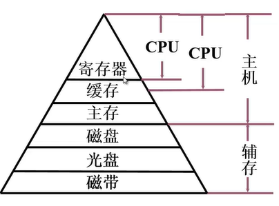
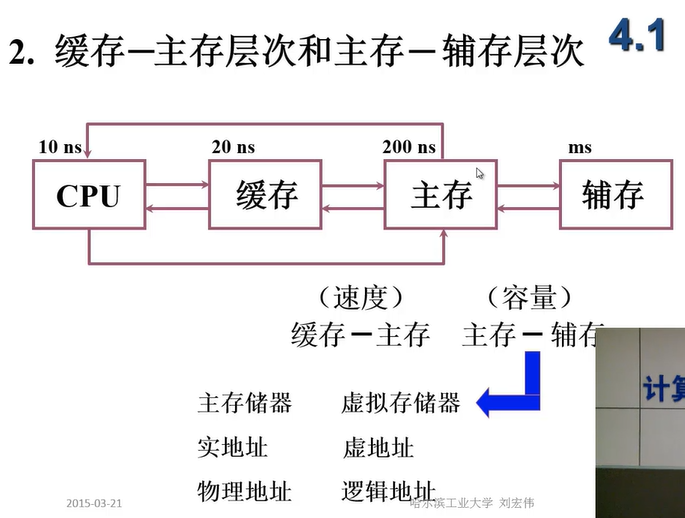

# 哈工大 计算机组成原理

## 第一章 计算机系统概论

### 冯诺依曼计算机的特点

1. 计算机由五大部件组成。
2. 指令和数据以同等地位存于存储器，可按地址寻访。
3. 指令和数据用二进制数表示。
4. 指令由操作码和地址码组成。
5. **存储程序**。（程序存放在存储器当中）
6. **以运算器为中心。**

### 存储器的基本组成

主存储器：MAR、MDR、存储体

存储体：存储单元->存储元件->存储字

存储单元存放一串二进制代码；存储字是存储单元中二进制代码的组合；存储字长为存储单元中二进制代码的位数。

MAR：存储器地址寄存器，反应了存储单元的个数。

MDR：存储器数据寄存器，反映了存储字长。

## 第二章 总线

总线就是连接各个部件的信息传输线，是各个部件共享的传输介质。

总线上信息传送方式有**串行**和**并行**两种。其中并行传输距离较近。

### 总线结构

1. 单总线结构：CPU、主存、多个I/O设备之间，共用同一条系统总线。
2. 面向CPU的双总线结构：在CPU与主存之间有M总线，CPU与其他I/O设备之间有一条I/O总线。
3. 以存储器为中心的双总线结构：CPU、主存、I/O设备共用一条系统总线，而CPU与主存之间挂接有一条存储总线。
4. I/O总线与主存总线构成的双总线结构：主存总线连接CPU与主存，并通过通道（具有特殊功能的处理器，由通道对I/O统一管理，一般在操作系统中具体描述）连接I/O总线，I/O总线连接各个I/O接口，至各个设备。
5. 三总线结构：CPU与主存通过主存总线连接，主存与高速外部设备通过DMA总线连接，CPU通过I/O总线与所有外部设备连接。

### 总线分类

1. 片内总线：芯片内部的总线。
2. 系统总线：计算机各个部件之间的信息传输线。
   1. 数据总线：双向，与机器字长、存储字长相关。
   2. 地址总线：单向，与存储地址、I/O地址有关。
   3. 控制总线：有出（中断请求、总线请求）有入（存储器读写、总线允许、中断确认）。
3. 通信总线：用于计算机系统之间 或 计算机系统与其它系统之间的通信。

### 总线控制

#### 总线判优控制

- 主设备（模块）：对总线有控制权。
- 从设备（模块）：响应从主设备发来的总线命令。
- 总线判优控制
  - 集中式：将总线判优逻辑置于一个设备上
    - 链式查询
    - 计数器定时查询
    - 独立请求方式
  - 分布式

#### 总线通信控制

1. **目的**：解决通信双方协调配合问题。
2. 总线**传输周期**：
   - 申请分配阶段：主模块申请，总线仲裁决定
   - 寻址阶段：主模块向从模块给出地址和命令
   - 传数阶段：主模块和从模块交换数据
   - 结束阶段：主模块撤销有关信息
3. 总线通信的四种方式
   - **同步通信**：由统一时标控制数据传送；由定宽定距的时钟来控制整个数据输入输出的过程，在给定的时间上要完成相应的操作。
   - **异步通信**：采用应答方式，没有公共时钟标准；不互锁/半互锁/全互锁。
   - **半同步通信**：同步、异步结合；**同步**指发送方用系统时钟前沿发信号，接收方用系统时钟后沿判断、识别；**异步**指允许不同速度的模块和谐工作，增加一条“等待”相应信号 *WAIT*。
   - **分离式通信**：充分挖掘系统总线每个瞬间的潜力；将一个总线传输周期分为两个子周期，在子周期1中，主模块申请占用总线，使用完后放弃总线的使用权，在子周期2中从模块申请占用总线，将各种信息送至总线上。

## 第三章 存储器

### 存储器分类

- 按存储介质
  - 半导体存储器：内存/U盘；TTL逻辑/MOS逻辑
  - 磁表面存储器：磁盘；磁头、磁载体
  - 磁芯存储器：core memory；硬磁材料、环状元件
  - 光盘存储器：激光、磁光材料
- 按存取方式
  - 存取时间与物理地址无关（随机访问）
    - 随机存储器：在程序执行过程中可读可写（RAM）
    - 只读存储器：在程序执行过程中只读（ROM）
  - 存取时间与物理地址有关（串行访问）
    - 顺序存取存储器（如磁带）
    - 直接存取存储器（如磁盘）
- 按在计算机中的作用
  - 主存储器
    - RAM：静态/动态 RAM
    - ROM：MROM/PROM/EPROM/EEPROM
  - 辅助存储器：磁盘、磁带、光盘
  - Flash Memory：U盘、固态硬盘
  - 高速缓冲存储器（Cache）

### 存储器的层次结构

 

### 主存储器的基本组成

主要包括：MAR、MDR、存储体 三大部分

**MAR**中保存了需要访问的存储单元的地址，经过**译码器**进行选定之后，才可以访问选的的存储单元，同样，**MDR**中保存了需要读出或写入的数据，其中读/写操作的判断通过**读写电路**和**控制电路**完成，

### 主存与CPU的联系

MDR与主存由双向的数据总线连接，用于读出和写入；MAR与主存由单向通向主存的地址总线连接，用于给出需要访问的内存单元地址；CPU与主存之间由单向通向主存的读/写线连接，用于控制信号的传输。

### 主存中存储单元地址分配

 编址单位：字节；每个字节都有一个地址；

大端大尾方式：高位字节地址为字存储地址；

小端小尾方式：低位字节地址为字存储地址；

### 主存的技术指标

存储容量：主存中存放二进制代码的总位数。

存储速度：存取时间：存储器的访问时间；存取周期：连续两次独立的存储器操作所需的最小时间间隔。

存储器的带宽：位/秒

### 半导体芯片简介

#### 半导体芯片的基本结构

半导体芯片 = 存储矩阵 + 读写电路 + 译码驱动 + 外部接口（地址线（单向） + 数据线（双向） + 片选线 + 读/写控制线）

**地址线和数据线**描述了芯片的容量：例如10位地址线与4位数据线的芯片容量为$2^{10}×4$ 即1K×4​位

**读/写控制线**，可用一根WE线表示，低电平写，高电平读；也可用两根信号线表示，OE线低电平输出（从存储矩阵输出至数据线，即允许读），WE线低电平输入（将数据线上的数据写入指定的存储单元当中）。

**片选线**即芯片选择线，所访问的信息位于哪个芯片中，就是由片选线确定的。一般由两种管脚组成：CS(chip select)线，当该线低电平时表示该芯片有效；CE(chip enable)线，芯片允许信号。

用8个16K×1位芯片同时存取组成一组16K×8位存储器，并且可以用4组芯片组成64K×8位的存储器，其中每组16K×8位存储器同时工作。使用片选线将它们连接，并且按顺序进行编号，即可进行片选读写。例如，当地址为65535时，片选线选择第四组芯片，即最后8片的片选有效。

#### 半导体芯片的译码驱动方式

##### 线选法

##### 重合法

