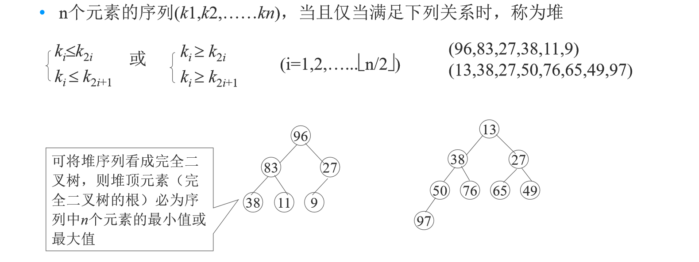

# 排序算法

## 排序的基本概念

**排序的稳定性**：若多个元素关键字相同，排序后相同关键字元素的相对次序保持不变，则是稳定排序，否则为不稳定排序。

**排序按待排序记录所在位置分类：**

- 内部排序：待排序记录存放在内存；

- 外部排序：排序过程中需访问外存；

**排序按策略分类：**

- 插入排序：直接插入排序、希尔排序；

- 交换排序：冒泡排序、快速排序；
- 选择排序：简单选择排序、堆排序；
- 归并排序：2-路归并排序；

## 插入排序-直接插入排序

### 基本思想

每次将一个待排序的记录插入到已排序好的数据区中，直到全部插完为止。

### 算法思路

```C
step1：令i = 0，j = 1；意味着r[0...i]为有序区，无序区为r[i+1...n-1]
step2：
while(j<n){
	//将r[j]插入有序区r[0...i]中
	t = r[j]
	while(j >= 1){
		if(t < r[j - 1]){
			r[j] = r[j - 1];
			j = j - 1;
			}
		else break;
		}
		r[j] = t;
		i = i + 1;
		j = j + 1;
}
step3：
return;
```

时间复杂度为$O(n^2)$，空间复杂度为$O(1)$。

### 带监视哨的直接插入排序

设置监视哨 r[0]，将带插入记录的值赋给 r[0]；进入查找循环之前，保存了 r[i] 的副本，记录后移时不会丢失 r[i] 的内容，循环中“监视”下标变量j是否越界，一旦越界（即j==0），能控制 while 循环结束。这样可以避免在while循环内每次都要检测 j 是否越界的问题。

## 插入排序-希尔排序（shell）

### 基本思想

shell排序又名缩小增量排序。直接插入排序比较相邻结点，一次比较最多把结点移动一个位置；如对位置间隔较大的结点进行比较，则结点一次比较后能跨过较大距离，可能提高排序速度。

### 算法思路

```C
step1：设置初始增量：k = di (di < n)
step2：按增量k，把全部记录从第一个记录起分组，所有相距为k的记录为一组，在各组内进行插入排序
step3：if(k == 1),转step4；否则取新的增量：k = d(i-1) [d(i-1)<di]转step2；
step4：return;
```

### 性能分析

每一趟以不同的增量进行插入排序，当di较大时，被移动的记录是跳跃式进行的；最后一趟排序时，di = 1，许多记录已经有序，不需要多少移动，所以能提高排序速度。

希尔排序的复杂度很难分析，在特定情况下可准确地估算关键字的比较和记录移动次数，但考虑到与增量间的依赖关系，要给出完整的数学分析尚难。

shell排序是不稳定的排序方法。

## 交换排序-冒泡排序

### 基本思想

比较相邻的元素。如果第一个比第二个大，就交换他们两个。对每一对相邻元素做同样的工作，从开始第一对到结尾的最后一对。在这一点，最后的元素应该会是最大的数。

针对所有的元素重复以上的步骤，除了最后一个。

持续每次对越来越少的元素重复上面的步骤，直到没有任何一对数字需要比较。

### 代码实现

```C
#include <stdio.h>
 
#define ARR_LEN 255 /*数组长度上限*/
#define elemType int /*元素类型*/
 
/* 冒泡排序 */
/* 1. 从当前元素起，向后依次比较每一对相邻元素，若逆序则交换 */
/* 2. 对所有元素均重复以上步骤，直至最后一个元素 */
/* elemType arr[]: 排序目标数组; int len: 元素个数 */
void bubbleSort (elemType arr[], int len) {
    elemType temp;
    int i, j;
    for (i=0; i<len-1; i++) /* 外循环为排序趟数，len个数进行len-1趟 */
        for (j=0; j<len-1-i; j++) { /* 内循环为每趟比较的次数，第i趟比较len-i次 */
            if (arr[j] > arr[j+1]) { /* 相邻元素比较，若逆序则交换（升序为左大于右，降序反之） */
                temp = arr[j];
                arr[j] = arr[j+1];
                arr[j+1] = temp;
            }
        }
}
 
int main (void) {
    elemType arr[ARR_LEN] = {3,5,1,-7,4,9,-6,8,10,4};
    int len = 10;
    int i;
     
    bubbleSort (arr, len);
    for (i=0; i<len; i++)
        printf ("%d\t", arr[i]);
    putchar ('\n');
     
    return 0;
}
```

## 交换排序-快速排序

### 基本思想

对一组无序的数据集合，选择任意**元素**作为基准点，使得：该基准点左边的所有记录都小于或等于它，右边的所有记录都大于或等于它；然后分别对左右半区重新进行快速排序。

### 算法思路

```C
step1：i = low，j = high；
step2：令t = data[i].key为基准点
step3：if(i == j) return i;
step4：在t的右半区(i+1,--j)寻找比t小的元素
	foreach pos in (i+1,--j){
		if(data[j].key<t)
		data[i]⇆data[j],break;
	}
step5：将基准点换到位置j；t = j；
step6：到t的左半区(++i,j-1)寻找比t大的元素
	foreach pos in(++i,j-1){
		if(data[j].key>t)
		data[i]⇆data[j],break;
	}
step7：将基准点换到位置i；t = i，转step3
```

### 性能分析

最好情况时，每次所取的基准都是当前无序区的中值；最坏情况下，每次划分的基准都是当前无序区中关键字最小（或最大）的记录。
$$
比较次数的最大值=\sum\limits_{i=1}^{n-1}(n-i)=\frac{n(n-1)}{2}=O(n^2)
$$

快速排序的平均时间复杂度为$O(nlog_2n)$，最坏情况下为$O(n^2)$。快速排序需要一个栈空间来实现递归，平均情况下空间复杂度为$O(log_2n)$，最坏情况下递归深度为n，所需栈空间为$O(n)$。快速排序是不稳定的排序方法。

## 选择排序-简单选择排序

### 基本思想

每次从待排序的记录中选出关键字最小（或最大）的记录，放在已排序的序列中，直到全部排完。是不稳定的排序方法。

## 选择排序-堆排序

### 基本思想

堆排序是简单选择排序的改进。直接选择排序从n个值中选出最小值要做n-1次比较，然后从其余n-1个记录中选出最小者要做n-2次比较，显然，相邻两趟中某些比较是重复的，为了避免重复比较，可采用树形选择排序比较。

**大根堆：**根节点（即堆顶）的关键字是堆里所有结点关键字中最大者的堆，成为大根堆。

**小根堆：**根节点（即堆顶）的关键字是堆里所有结点关键字中最小者的堆，成为小根堆。



一组待排序的n个数据元素，用一维向量存储；按某种方法将其生成一个大根堆，该大根堆的根，就是键值最大的元素；将根与向量尾部的元素互换，即最大值放到向量的末尾，将剩余的n-1个元素再次调整成大根堆，可得到次大值；将次大值放到向量的倒数第二的位置……如此反复，直到全部关键字排好序为止。

生成大根堆时，应从无序序列的第【n/2】（向下取整）个元素（即此无序序列对 应的完全二叉树的最后一个非终端结点）起， 至第一个元素止，进行反复筛选。

将根结点值与左、右子树的根结点值进行比较，并与其中大者进行交换；重复上述操作，直至叶子结点，将得到新的堆，称这个从堆顶至叶子的调整过程为筛选 。

### 性能分析

堆排序只需一个记录大小的辅助空间；堆排序算法时间复杂度为：$O(nlog_2n)$。

